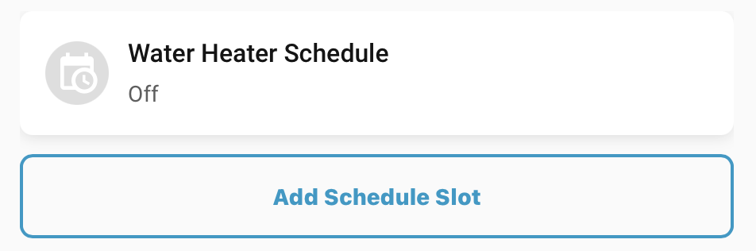
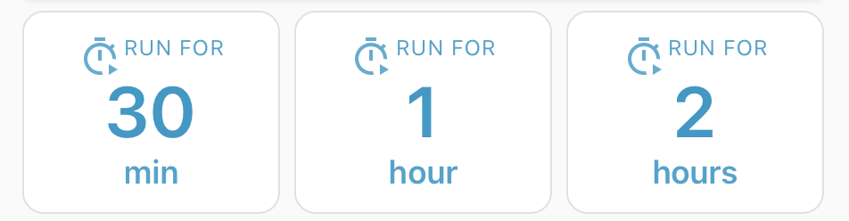
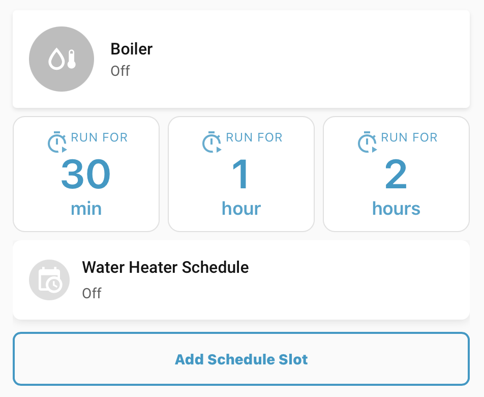
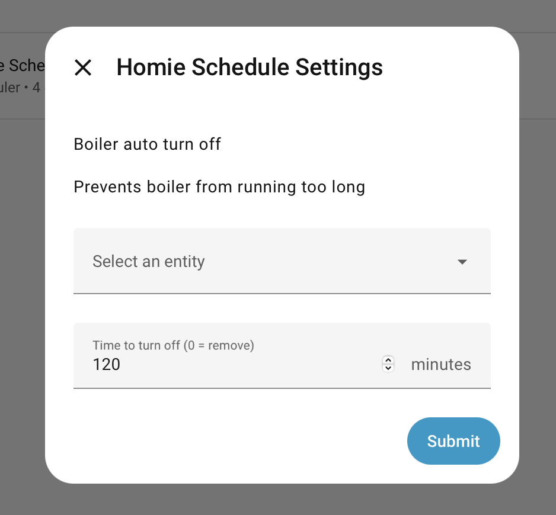

# Homie Scheduler Cards

Lovelace cards for schedule management (boiler, climate).

## Cards description

- **Boiler slots** – add/edit schedule slots for boiler/switch (time, duration, weekdays)
- **Boiler button** – one-click run for X minutes or recirculation mode (30 min)
- **Boiler status** – icon toggle, status text, optional auto turn-off
- **Climate slots** – schedule slots for climate entities (presets, time, weekdays)

## Requirements

- [**Homie Scheduler** integration](https://github.com/positivecrash/homie-scheduler-integration)
- Home Assistant 2025.9 or newer

## Screenshots

| Boiler slots | Boiler status | Boiler button (duration) |
|--------------|---------------|---------------------------|
|  |  |  |

| All cards (boiler) | Settings |
|--------------------|----------|
|  |  |

Screencast: [screencast-boiler-automation.mov](docs/images/screencast-boiler-automation.mov)


## Installation

1. Copy all files from `dist/` (the `.js` files and `homie-custom-styles.css`) into your Home Assistant config under `config/www/homie/` (create the `homie` folder if needed).
2. In HA: **Settings → Dashboards → Resources** → Add one resource: `/local/homie/homie-scheduler-cards.js` as **JavaScript Module** (loader loads all cards from the same folder). Optionally add `/local/homie/homie-custom-styles.css` as **Stylesheet**. Then add cards to the dashboard (e.g. `type: custom:homie-scheduler-boiler-slots`).


---


## Project Structure

```
homie-scheduler-cards/
├── src/
│   ├── boiler/
│   │   ├── button/       # Boiler schedule button card
│   │   ├── slots/        # Boiler schedule slots card
│   │   └── status/       # Boiler status card
│   ├── climate/
│   │   └── slots/        # Climate schedule slots card
│   ├── shared/           # Shared build script and components
│   └── homie-custom-styles.css  # Template for custom styles
├── dist/                  # Build output (loader + all .js + homie-custom-styles.css)
│
└── README.md
```

---

## Cards Usage

### boiler/slots

Schedule management card for boiler/switch entities:
- Add/edit schedule slots
- Time, duration (optional), weekdays
- Enable/disable individual slots
- Intuitive interface with expandable cards
- Automatic service_start/service_end injection for switch entities

**Usage:**
```yaml
type: custom:homie-scheduler-boiler-slots
entity: switch.boiler
title: Water Heater Schedule
# Optional: duration configuration
duration_range: [15, 1440]  # [min, max] in minutes (default: [15, 1440])
duration_step: 15            # Step in minutes (default: 15)
# Or use separate parameters:
# min_duration: 15
# max_duration: 1440
# duration_step: 15
```

### boiler/button

**Features:**
- One-click schedule activation
- Configurable duration (in minutes) for normal mode, fixed 30 minutes for recirculation
- Smart state detection (disabled when entity is already on)
- Active schedule indicator (yellow button when running)
- Human-readable duration formatting
- State synchronization across multiple buttons for the same entity
- State persistence via integration (works across browser tabs/devices)

**Usage - Normal Mode:**
```yaml
type: custom:homie-scheduler-boiler-button
entity: switch.boiler
duration: 60  # Duration in minutes (default: 60)
```

**Usage - Recirculation Mode:**

Works same as normal, but has different appearance.

```yaml
type: custom:homie-scheduler-boiler-button
entity: switch.boiler
mode: recirculation
# Duration defaults to 30 minutes, but can be overridden:
# duration: 45  # Optional: custom duration in minutes
```


### boiler/status

Status card for boiler/switch entities with icon-based toggle:
- Icon in circle with on/off states – click to toggle switch
- Configurable title (falls back to entity friendly_name or entity_id)
- Dynamic subtitle showing status and next run information

**Features:**
- One-click toggle via icon circle
- Smart subtitle text:
  - When off + has schedules: "Next run: [time]" or countdown
  - When on + has turn-off time (from button card or integration max_runtime): "Runs, will be off in [time]"
  - When on + no turn-off time: "Runs, please switch off manually"
- Title fallback: config.title → entity friendly_name → entity_id

**Usage:**
```yaml
type: custom:homie-scheduler-boiler-status
entity: switch.boiler
title: Boiler  # Optional: custom title (falls back to friendly_name or entity_id)
```

**Configuration:**
- `entity` (required) – Switch/input_boolean entity to control
- `title` (optional) – Custom title for the card. If not provided, uses entity's friendly_name, or falls back to entity_id


### climate/slots

Schedule management card for climate entities:
- Add/edit schedule slots
- HVAC mode selection (heat/cool/auto/etc.)
- Time, duration (optional), weekdays
- Enable/disable individual slots
- Intuitive interface with expandable cards
- Shows HVAC mode in slot status and "Next run"

**Usage:**
```yaml
type: custom:homie-scheduler-climate-slots
entity: climate.ac
title: AC Schedule
# Optional: duration configuration (duration is optional for climate)
duration_range: [15, 1440]  # [min, max] in minutes (default: [15, 1440])
duration_step: 15            # Step in minutes (default: 15)
```

---

## Customization

All Homie Scheduler cards support customization through CSS variables. Override styles in **`/config/www/homie/homie-custom-styles.css`** (added to Lovelace Resources during installation). Cards live in shadow DOM: set variables on **`home-assistant`** for global overrides, or on the card type (e.g. `homie-scheduler-boiler-slots`) for per-card overrides.

### Slots cards (homie-scheduler-boiler-slots, homie-scheduler-climate-slots)

```css
homie-scheduler-boiler-slots,
homie-scheduler-climate-slots {
  /* Card (header, slot card) */
  --homie-slots-accent: var(--primary-color, #03a9f4);
  --homie-slots-bg: var(--ha-card-background, rgba(255, 255, 255, 0.9));
  --homie-slots-radius: var(--ha-card-border-radius, 8px);
  --homie-slots-shadow: var(--ha-card-box-shadow, 0 2px 8px rgba(0, 0, 0, 0.1));
  --homie-slots-text: var(--primary-text-color, #212121);
  --homie-slots-text-secondary: var(--secondary-text-color, #757575);
  --homie-slots-text-on-accent: var(--text-primary-on-background, #ffffff);
  --homie-slots-disabled: var(--disabled-color, #9e9e9e);

  /* Select (.homie-select) */
  --homie-slots-bg-select: var(--ha-card-background, rgba(255, 255, 255, 0.9));
  --homie-slots-divider-select: var(--divider-color, rgba(0, 0, 0, 0.12));
  --homie-slots-text-select: var(--primary-text-color, #212121);
  --homie-slots-radius-select: var(--mdc-shape-small, 4px);
  --homie-slots-focus-ring: 0 0 0 2px rgba(3, 169, 244, 0.1);

  /* Input / select padding (shared for .homie-input and .homie-select) */
  --homie-slots-padding-input-vertical: var(--mdc-shape-small, 4px);
  --homie-slots-padding-input-horizontal: var(--mdc-shape-small, 8px);
  /* Input (.homie-input) border and radius */
  --homie-slots-border-input: 1px solid var(--divider-color, rgba(0, 0, 0, 0.12));
  --homie-slots-radius-input: var(--mdc-shape-small, 4px);

  /* Dividers, radii, secondary bg, error */
  --homie-slots-divider: var(--divider-color, rgba(0, 0, 0, 0.12));
  --homie-slots-radius-small: var(--mdc-shape-small, 4px);
  --homie-slots-radius-medium: var(--mdc-shape-medium, 8px);
  --homie-slots-secondary-bg: var(--secondary-background-color, #f5f5f5);
  --homie-slots-error-color: var(--error-color, #f44336);

  /* Button outline (.button-outline) */
  --homie-slots-button-outline-padding: var(--mdc-button-horizontal-padding, 16px);
  --homie-slots-button-outline-margin-top: var(--mdc-layout-grid-gutter, 12px);
  --homie-slots-button-outline-radius: var(--ha-card-border-radius, 8px);
  --homie-slots-button-outline-bg: transparent;
  --homie-slots-button-outline-border: 2px solid var(--primary-color, #03a9f4);
  --homie-slots-button-outline-color: var(--primary-color, #03a9f4);
  --homie-slots-button-outline-font-size: var(--mdc-typography-button-font-size, 14px);
  --homie-slots-button-outline-font-weight: var(--mdc-typography-button-font-weight, 900);
  --homie-slots-button-outline-letter-spacing: var(--mdc-typography-button-letter-spacing, 0em);
  --homie-slots-button-outline-min-height: var(--mdc-button-height, 36px);
  --homie-slots-button-outline-hover-shadow: 0 2px 8px rgba(3, 169, 244, 0.3);
  --homie-slots-button-outline-active-transform: scale(0.98);
  --homie-slots-button-outline-active-shadow: 0 1px 4px rgba(3, 169, 244, 0.2);

  /* Popup (.popup-content) */
  --homie-slots-popup-background: var(--ha-dialog-background, var(--ha-card-background));
  --homie-slots-popup-color: var(--primary-text-color, #212121);
  --homie-slots-popup-backdrop-filter: var(--ha-card-backdrop-filter, none);
  --homie-slots-popup-box-shadow: var(--ha-card-box-shadow, none);
  --homie-slots-popup-border-radius: var(--ha-card-border-radius, 16px);
}
```

### Button card (homie-scheduler-boiler-button)

```css
homie-scheduler-boiler-button {
  --homie-button-accent: var(--primary-color, #03a9f4);
  --homie-button-radius: var(--ha-card-border-radius, 12px);
  --homie-button-bg-inactive: var(--ha-card-background);
  --homie-button-bg-active: var(--primary-color, #03a9f4);
  --homie-button-bg-disabled: var(--ha-card-background);
  --homie-button-text-inactive: var(--primary-color, #03a9f4);
  --homie-button-text-active: var(--text-primary-color, #fff);
  --homie-button-text-disabled: var(--disabled-text-color, rgba(255,255,255,0.5));
  --homie-button-shadow: var(--ha-card-box-shadow, none);
  --homie-button-shadow-active: var(--ha-card-box-shadow, none);
  --homie-button-backdrop-filter: var(--ha-card-backdrop-filter, none);
  --homie-button-border-color: var(--divider-color, rgba(255, 255, 255, 0.12));
}
```

### Status card (homie-scheduler-boiler-status)

```css
homie-scheduler-boiler-status {
  --homie-status-accent: var(--state-switch-on-color, var(--warning-color, #ffc107));
  --homie-status-bg: var(--ha-card-background, rgba(255, 255, 255, 0.9));
  --homie-status-radius: var(--ha-card-border-radius, 4px);
  --homie-status-shadow: var(--ha-card-box-shadow, 0 2px 4px rgba(0, 0, 0, 0.1));
  --homie-status-text: var(--primary-text-color, #212121);
  --homie-status-text-secondary: var(--secondary-text-color, #757575);
  --homie-status-text-on-accent: var(--text-primary-on-background, #ffffff);
  --homie-status-disabled: var(--disabled-color, #9e9e9e);
}
```

---

## Build (only for development)

From each card directory:

```bash
cd src/boiler/button && bash build.sh
cd src/boiler/slots  && bash build.sh
cd src/boiler/status && bash build.sh
cd src/climate/slots && bash build.sh
```

Output goes to `dist/` (and `homie-custom-styles.css` is copied there on each build).


## License

MIT – see [LICENSE](LICENSE).
