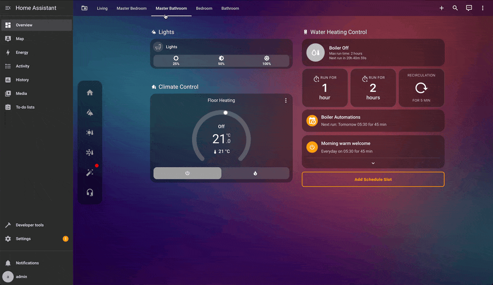
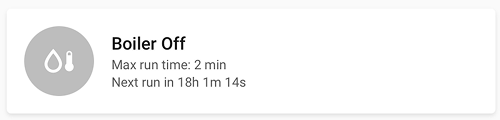
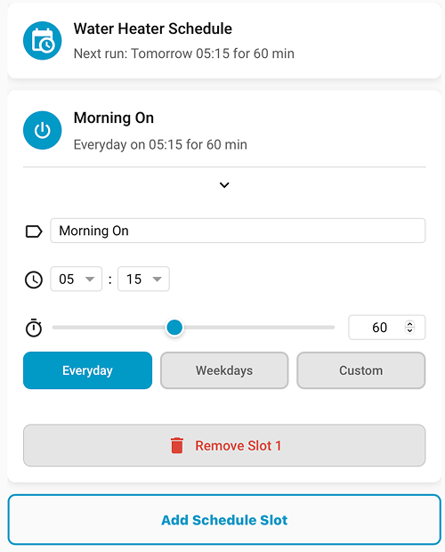
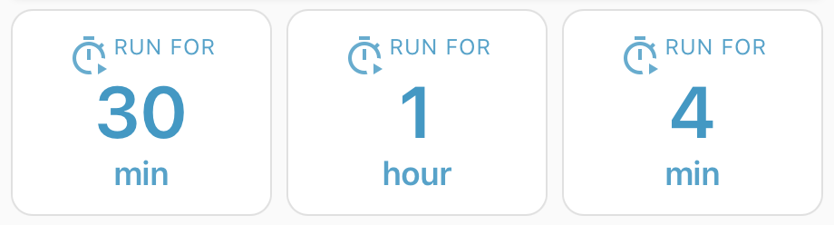

# Easy schedule & run automation in Home Assistant

Lovelace cards for schedule management in Home Assistant. Set up in one click when to switch off your smart home device. Easy UI scheduler for intuitive run slots. The [Homie Scheduler](https://github.com/positivecrash/homie-scheduler-integration) integration supports all switch-like entities (switch, input_boolean, light, fan, cover) and climate. Cards are split by purpose because the UI for different devices should be different: boiler cards for water heaters and on/off appliances, climate cards for AC and thermostats (e.g. underfloor heating). More card variants are planned.

## Cards list

- **Boiler slots** – add/edit schedule slots for boiler/switch (time, duration, weekdays)
- **Boiler button** – one-click run for X minutes or recirculation mode
- **Boiler status** – icon toggle, status text, latest activity info, optional auto turn-off
- **Climate slots** – schedule slots for climate entities (presets, time, weekdays) *(testing for now)*

## Requirements

- [**Homie Scheduler** integration](https://github.com/positivecrash/homie-scheduler-integration)
- Home Assistant 2025.9 or newer

## Demonstration

You can build the dashboard you prefer with customizable separate cards. See how the Water Heater dashboard is built (for the iOS theme I also overrode some CSS variables for the cards).




## Water Heater cards features

### Boiler status

<p align="center"></p>

- Latest activity status: when and for how long the boiler was switched on
- Max run status: if set in the integration settings, shows max run time
- Next run status: if a schedule is set up via the slots card, shows time left until the next run
- Customizable name
- On/off status next to the name
- Toggle by clicking the icon circle

### Boiler schedule slots


<p align="center"></p>

Runs the boiler on a schedule without creating automations one by one: change times and weekdays, enable or disable slots, and set clear names—all from the card. For how the schedule is stored and enforced, see the [integration README](https://github.com/positivecrash/homie-scheduler-integration).

### Boiler run button

<p align="center"></p>

Set fixed run durations in the card. Configure your own set of duration buttons.


## Installation

1. Copy all files from `dist/` (the `.js` files and `homie-custom-styles.css`) into your Home Assistant config under `config/www/homie/` (create the `homie` folder if needed).
2. In HA: **Settings → Dashboards → Resources** → add each `.js` card file from `/local/homie/` as a **JavaScript Module**. Optionally add `/local/homie/homie-custom-styles.css` as **Stylesheet**. Then add cards to the dashboard (e.g. `type: custom:homie-scheduler-boiler-slots`).


---


## Project Structure

```
homie-scheduler-cards/
├── src/
│   ├── boiler/
│   │   ├── button/       # Boiler schedule button card
│   │   ├── slots/        # Boiler schedule slots card
│   │   └── status/       # Boiler status card
│   ├── climate/
│   │   └── slots/        # Climate schedule slots card
│   ├── shared/           # Shared build script and components
│   └── homie-custom-styles.css  # Template for custom styles
├── dist/                  # Build output (loader + all .js + homie-custom-styles.css)
│
└── README.md
```

---

## Cards Usage

### boiler/slots

```yaml
type: custom:homie-scheduler-boiler-slots
entity: switch.boiler
title: Water Heater Schedule
# Optional: duration configuration
duration_range: [15, 1440]  # [min, max] in minutes (default: [15, 1440])
duration_step: 15            # Step in minutes (default: 15)
# Or use separate parameters:
# min_duration: 15
# max_duration: 1440
# duration_step: 15
```

### boiler/button

**Normal Mode:**
```yaml
type: custom:homie-scheduler-boiler-button
entity: switch.boiler
duration: 60  # Duration in minutes (default: 60)
```

**Recirculation Mode:**

Works same as normal, but has different appearance.

```yaml
type: custom:homie-scheduler-boiler-button
entity: switch.boiler
mode: recirculation
# Duration defaults to 30 minutes, but can be overridden:
# duration: 45  # Optional: custom duration in minutes
```


### boiler/status

```yaml
type: custom:homie-scheduler-boiler-status
entity: switch.boiler
title: Boiler  # Optional: custom title (falls back to friendly_name or entity_id)
```


### climate/slots

```yaml
type: custom:homie-scheduler-climate-slots
entity: climate.ac
title: AC Schedule
# Optional: duration configuration (duration is optional for climate)
duration_range: [15, 1440]  # [min, max] in minutes (default: [15, 1440])
duration_step: 15            # Step in minutes (default: 15)
```

---

## Customization

All Homie Scheduler cards support customization through CSS variables. Override styles in **`/config/www/homie/homie-custom-styles.css`** (added to Lovelace Resources during installation).

All CSS variables are listed in **`src/homie-custom-styles.css`** with comments for each card (slots cards, button card, status card). Copy that file to `/config/www/homie/homie-custom-styles.css`, add it as a Lovelace Stylesheet, then uncomment and edit the blocks you need.

---

## Build (only for developers)

From each card directory:

```bash
cd src/boiler/button && bash build.sh
cd src/boiler/slots  && bash build.sh
cd src/boiler/status && bash build.sh
cd src/climate/slots && bash build.sh
```

Output goes to `dist/` (and `homie-custom-styles.css` is copied there on each build).


## License

MIT – see [LICENSE](LICENSE).
